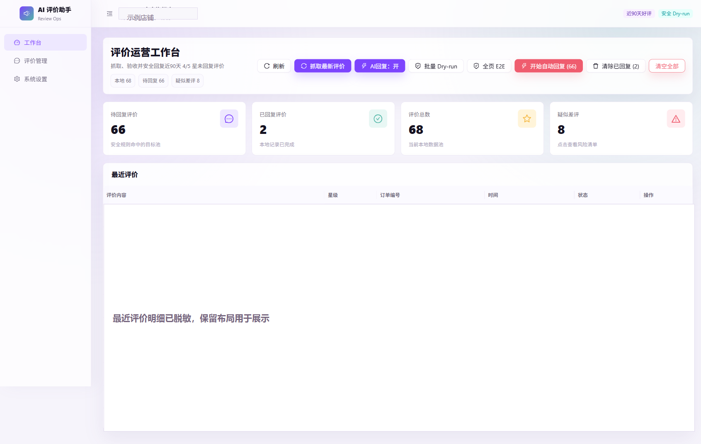
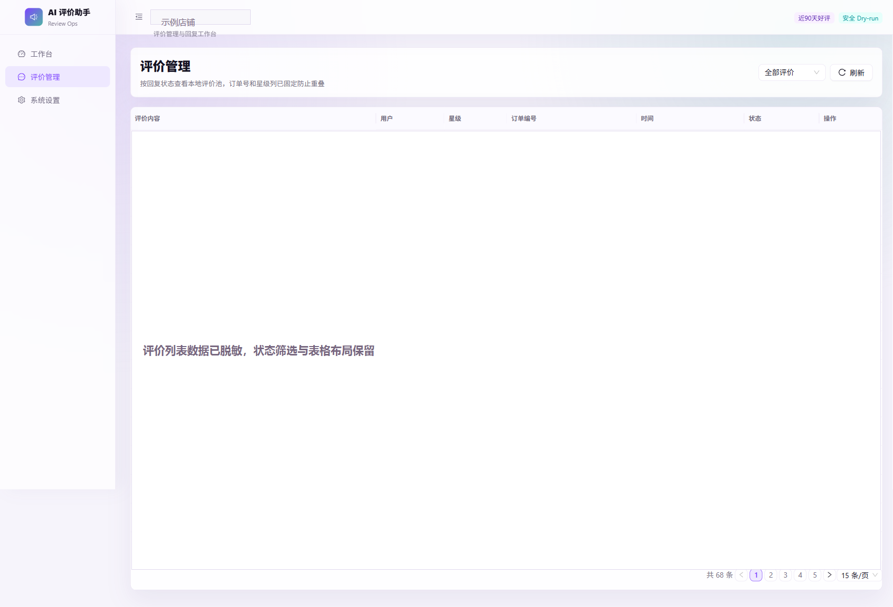
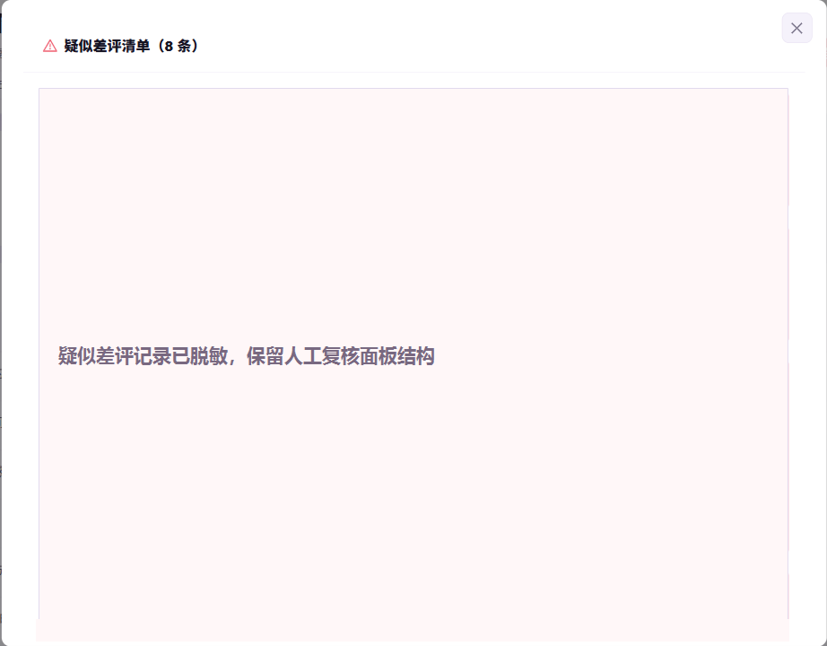

# 拼多多评价自动回复助手

一个本地运行的拼多多商家评价工作台，支持多店铺登录、评价抓取、DeepSeek 回复生成、情感风险识别，以及疑似差评的飞书和企业微信通知。

> [!IMPORTANT]
> 本项目不是拼多多官方产品。请仅在你有权管理的商家账号中使用，并遵守平台规则与当地法律。建议先用 `dryRun` 验证任务范围；登录、验证码、滑块、安全验证和平台风控必须人工处理，程序不会绕过这些机制。

## 工作方式

1. 为店铺创建独立账号并完成人工登录；
2. 抓取当前账号近 30、90 或 180 天的 4/5 星未回复评价；
3. 结合评价语义判断回复风险；
4. 明确好评自动生成回复，中性评价采用保守策略；
5. 疑似差评不自动提交，转入人工复核并按配置发送通知；
6. 保存执行进度与结果，便于后续检查。

## 核心功能

- 多账号独立登录态、独立评价池与顺序处理；
- DeepSeek 回复生成、提示词测试、恢复默认与 AI 优化；
- 好评、中性评价和疑似差评的分级处理；
- 疑似差评写入飞书多维表格，并通过企业微信或飞书群机器人汇总提醒；
- Express 本地 API 与 SSE 实时进度事件；
- Windows 便携文件夹构建；
- 通过 `automation-manifest.json` 接入内部自动化任务托管平台。

## 界面预览

图片均为脱敏示例，不包含真实订单、用户、评价、密钥、Webhook 或登录态。

### 评价运营工作台



### 评价管理



### 疑似差评人工复核



## 本地开发

建议使用 Node.js 22。

安装依赖：

```powershell
cd server
npm ci

cd ..\web
npm ci
```

分别启动后端与前端：

```powershell
cd server
npm start

cd web
npm run dev
```

后端默认监听 `http://localhost:3001`。生产构建：

```powershell
cd server
npm run build
```

便携产物位于 `server/dist`。复制到其他电脑时必须复制整个目录，不能只复制可执行文件。

## 自动化托管接口

托管平台从仓库根目录读取 [automation-manifest.json](automation-manifest.json)。主要接口：

| 用途 | 请求 |
| --- | --- |
| 健康检查 | `GET /api/health` |
| 任务进度 | `GET /api/automation/events/{jobId}` |
| 停止任务 | `POST /api/automation/stop/{jobId}` |

动作包括当前账号抓取、当前账号回复、全部账号回复、端到端演练和店铺名识别。自动回复动作均支持 `dryRun`；执行前请再次确认账号、店铺、时间范围、任务上限和风险评价处理策略。

## 项目结构

| 路径 | 用途 |
| --- | --- |
| `server` | Express API、Playwright 自动化、数据服务与测试 |
| `web` | React、Ant Design 和 Vite 前端 |
| `automation-manifest.json` | 自动化托管平台动作声明 |
| `好评例子.txt` | 默认好评模板示例 |

## 测试

```powershell
cd server
npm test

cd ..\web
npm run lint
npm run build
```

## 数据与安全

API Key、飞书配置、企业微信 Webhook、评价数据和浏览器登录态只应保存在当前电脑的用户数据目录。以下内容不得提交：

- `settings.json`、`reviews.json`；
- `browser-data*`、`.playwright-mcp`；
- `node_modules`、`server/dist`；
- 真实 API Key、Webhook、飞书 App Secret 与登录资料。

自动化可能因后台页面改版、网络波动或平台限制而失败。提交回复前应核对页面上的店铺、评价、回复内容和提交状态；不能只依据本地日志判断平台操作成功。

## 发布与许可证

仓库当前没有公开 GitHub Release。项目也尚未提供明确的开源许可证；在获得作者授权前，不应默认拥有复制、修改或分发代码的权利。
